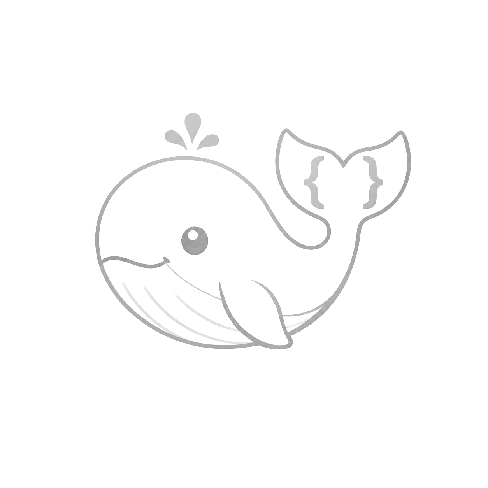
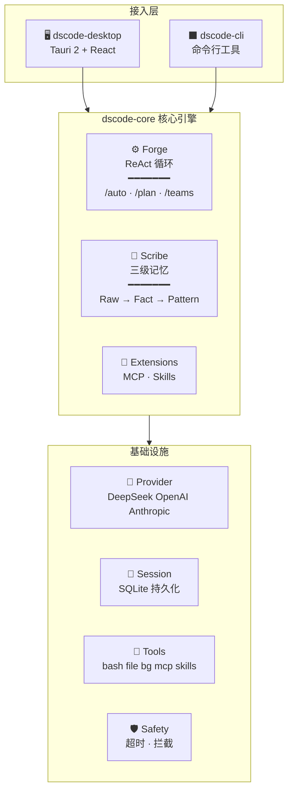

<p align="center">
  
  
</p>

<h1 align="center">DS Code</h1>

<p align="center">
  <strong>通用 AI 代码助手</strong> · DeepSeek 原生 · 跨模型
  <br/>
  桌面 GUI 应用。Rust 引擎，React 前端，Tauri 外壳。
</p>

<p align="center">
  
  
  
  
</p>

---

## 架构 Architecture



## 功能 Features

### 核心引擎 Core Engine
- **ReAct 智能体循环** — 流式推理 + 工具调用，内建死循环检测与错误抑制
- **上下文窗口** — 可配置最高 1M tokens，支持阈值触发自动压缩
- **工具链校验** — 加载时 + 运行时自动清理孤立工具调用，杜绝 400 错误
- **多模型支持** — DeepSeek V4、OpenAI、Anthropic Claude（原生 API）、本地 Ollama
- **思考模式** — Anthropic 扩展思考 + DeepSeek R1 推理链，支持 reasoning_effort 配置

### /auto 自动执行模式
- 任务自动拆解为子任务，逐个执行
- 审查 → 执行 → 评分 循环，质量评分 (0-100)
- 停滞检测 + 自动重新拆解（最多 3 轮重组）
- 可与 /teams 叠加：独立子任务并行执行（最多 4 个并发）

### /plan 五阶段需求评审
- 深度访谈：范围 → 需求 → 设计 → 风险 → 质量
- LLM 驱动的自适应提问，自动代码库快照
- 生成结构化 PRD 文档（架构决策、实施步骤、测试计划）

### /teams 多智能体协作
- 无限子 Agent 分发，实时进度监控
- 与 /auto 叠加：子任务并行执行 + 自动双模式
- 结果聚合与合并指令

### Scribe 三级记忆系统
- **Raw Messages** → **Facts (三元组)** → **Patterns (泛化模式)**
- 全文搜索 (FTS5) + 模式匹配
- 事实三元组自动提取与模式归纳

### 扩展生态 Extensions
- **MCP** — Model Context Protocol 全生命周期管理（连接、工具发现、代理注册为 `mcp_<server>_<tool>`）
- **Skills** — Agent Skills / skills.sh 生态系统兼容
  - YAML 前置元数据的技能文件，按触发器路由
  - 自动激活匹配技能，支持脚本/参考文档/资源目录
  - `do_skill_install` 从 GitHub 安装第三方技能包

### 桌面应用 Desktop GUI
- **附件上传** — 拖拽/粘贴文件（图片、文本、代码），自动识别类型
- **模型切换** — 运行时切换模型与 Provider
- **团队模式** — 一键启用多 Agent 协作
- **会话管理** — 创建/重命名/删除/搜索会话，SQLite 持久化
- **设置面板** — MCP 服务器配置、Skills 管理、Provider API Key
- **流式渲染** — Thinking 块、Tool Call 卡片、Fact 提取实时展示

---

## 快速开始 Quick Start

### 环境要求 Prerequisites
- Rust 1.85+
- Node.js 18+
- macOS / Linux / Windows

### 桌面应用 Desktop GUI
```bash
# 下载预编译安装包
# https://github.com/fivif/dscode/releases

# 或从源码运行
cd crates/dscode-desktop/ui && npm install
cd .. && cargo tauri dev
```

### 命令行 CLI
```bash
cargo run -p dscode-cli -- "分析 src/main.rs"

# Teams 模式
cargo run -p dscode-cli -- --teams "重构认证模块"
```

### 构建
```bash
make build          # Release 构建
make build-debug    # Debug 构建
make test           # 运行所有测试
make lint           # Clippy + 格式检查
make all            # 构建 + 测试 + Lint
```

---

## 配置 Configuration

配置文件位于 `~/.dscode/config.toml`：

```toml
default_model = "deepseek/deepseek-v4-pro"
router_model = "deepseek/deepseek-chat"   # 廉价路由模型
active_provider = "deepseek"

[providers.deepseek]
api_key = "your-api-key"
base_url = "https://api.deepseek.com/v1"
enabled = true

[providers.openai]
api_key = "your-openai-key"
base_url = "https://api.openai.com/v1"
enabled = false

[providers.anthropic]
api_key = "your-anthropic-key"
base_url = "https://api.anthropic.com"
enabled = false

[context]
window_tokens = 1000000        # 上下文窗口大小
compress_threshold = 0.8       # 压缩触发阈值
compress_min_history = 4       # 最少保留消息数

[generation]
max_tokens = 8192
temperature = 0.7
reasoning_effort = "medium"    # low | medium | high

[safety]
tool_timeout_secs = 120        # 工具执行超时

[session]
retention_days = 30            # 会话保留天数

[proxy]
enabled = false
http = "http://127.0.0.1:7890"
https = "https://127.0.0.1:7890"

[agent]
system_prompt_extra = ""       # 追加到默认系统提示
```

---

## 项目结构 Project Structure

```
DS_code/
├── crates/
│   ├── dscode-core/                # 核心引擎
│   │   └── src/
│   │       ├── agent/              # ReAct Forge 循环、上下文管理、流事件
│   │       ├── auto/               # /auto 任务拆解与执行
│   │       ├── config/             # 配置系统 (TOML)
│   │       ├── extensions/         # MCP + Skills 扩展系统
│   │       ├── magi/               # /auto 自动执行引擎
│   │       ├── memory/             # Scribe 三级记忆系统
│   │       ├── plan/               # /plan 五阶段需求访谈 + PRD
│   │       ├── providers/          # LLM 适配器 (OpenAI/Anthropic/DeepSeek)
│   │       ├── safety/             # 安全守卫
│   │       ├── session/            # 会话持久化 (SQLite)
│   │       ├── teams/              # 多 Agent 团队分发与监控
│   │       └── tools/              # 工具注册表与实现 (bash/fs/bg/skills/mcp)
│   ├── dscode-desktop/             # Tauri 2.x 桌面应用
│   │   ├── src/                    # Rust 后端 (commands, state, events)
│   │   └── ui/                     # React 18 前端 (TypeScript + Tailwind)
│   │       └── src/
│   │           ├── components/     # UI 组件 (Chat, Settings, Sidebar)
│   │           ├── hooks/          # 自定义 Hooks
│   │           ├── lib/            # 工具库 (tauri bindings, types, models)
│   │           └── stores/         # Zustand 状态管理
│   ├── dscode-tui/                 # ratatui 终端界面
│   └── dscode-cli/                 # 单次命令行工具
├── config/
│   └── default.toml                # 默认配置模板
├── Cargo.toml                      # 工作区根配置
└── README.md
```

---

## 技术栈 Tech Stack

| 层 Layer | 技术 Technology |
|---|---|
| 核心引擎 | Rust (tokio, reqwest, rusqlite) |
| 桌面 GUI | Tauri 2.x + React 18 + TypeScript + Tailwind CSS |
| 状态管理 | Zustand |
| 会话存储 | SQLite (rusqlite + FTS5) |
| Markdown | react-markdown + remark-gfm |
| 配置 | serde + TOML |
| 包管理 | pnpm |

---

## 文档索引 Documentation Index

| 文档 | 描述 |
|------|------|
| [README.md](README.md) | 项目概览与快速开始 |
| [LICENSE](LICENSE) | MIT 许可证 |
| [config/default.toml](config/default.toml) | 配置文件模板 |

---

## 许可证 License

MIT — 详见 [LICENSE](LICENSE)
